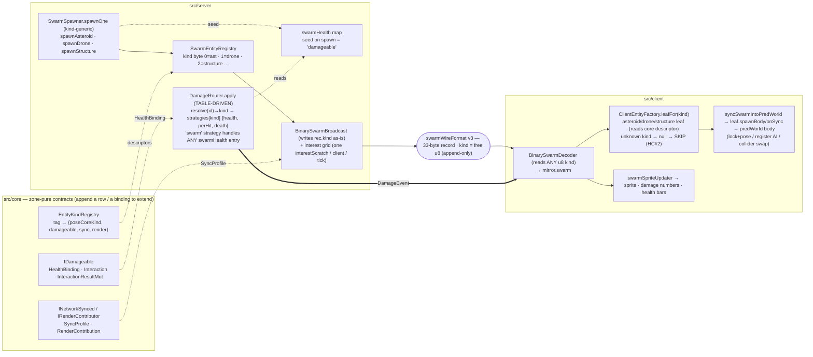

# Generic Entity Pipeline

> **Status: OOP migration in progress** (branch `feat/generic-entity-pipeline`).
> The original build proved the thesis with a *data-driven* dispatch; it is being
> rebuilt as the planned **OOP entity model** — real leaf classes
> ([src/server/entity/leaves/](../../src/server/entity/leaves/)) that *compose*
> their damage/sync/render capabilities, a single monomorphic damage call site,
> and (B4) the server `EntitySyncRouter` + client `entityFactory` extraction layer.
> **B1** (leaf classes), **B2** (`DamageRouter` → `EntityResolver` + monomorphic
> `applyInteraction`), and **B3** (weapon flyweights — both fire resolvers' mode
> if-tree collapsed to one `weapon.resolveFire(ctx, sink)`) are landed and
> byte-identical (golden-master + netgate + fire-parity + a combat E2E green);
> **B4** (extraction layer + `resolveEntityDisplayPose` rename) and **B5**
> (structure re-proven *through* the generic layer) are in progress.
> Sections below tagged *(data-driven — superseded)* describe the build being
> replaced and are rewritten as each OOP phase lands.

## Why

EQX Peri grows *horizontally* — the roadmap keeps adding world-object types
(structures, capital ships, debris, black holes, mines, pickups). Before this
work, adding a type meant re-implementing the same four concerns from scratch in
several places, because dispatch was keyed on the **shape of a target's id
string**:

- `DamageRouter.apply` — a 4-branch if-tree (`wreck-` prefix → lingering
  `!isActive` → active `playerId` → swarm registry).
- `ProjectilePipeline` / `MissileSimulation` — the same fan-out re-implemented as
  collision passes.
- `ShieldHullRouter` — `damageShipLayered` (schema) vs `damageSwarmLayered` (maps).

The user's goal, in their words: *"when I add new structures/ships/debris/black
holes, I'm not starting from scratch… the bugs are the leaf's gameplay logic, not
'why can't I see it / why isn't it updating / why can't I damage it.'"* A new type
should be **a leaf + a small descriptor**, and networking / construction /
rendering / damage come for free.

## The three layers (genericity lives in registration + routing, NOT the wire)

1. **Pose-core wire stays homogeneous + UNCHANGED.** The 33-byte binary swarm
   record (`src/shared-types/swarmWireFormat.ts`, v3) carries the generic
   per-entity info every object has (x/y/vx/vy/angle/angvel + a `kind` byte). It
   is fast *because* it is branch-free and fixed-stride. A new pose-core-fitting
   type rides it via a **new `kind` byte value** (asteroid=0, drone=1,
   structure=2, …) with **no stride change and no `SWARM_WIRE_VERSION` bump** —
   the byte is a free `u8`. (Adding a new *continuous* field would force a
   deliberate v4 bump; a new kind value does not.)
2. **Capability extras ride OTHER channels** — the slim JSON snapshot slices or
   discrete event broadcasts.
3. **The generic part is registration + routing.** Each kind declares descriptors
   once; the dispatch/sync/render seams read the descriptor instead of branching
   on id-string shape.

## What each phase delivered

| Phase | Deliverable | Key files |
|---|---|---|
| **P1** | Zone-pure `Entity` base + capability contracts (`IDamageable`, `INetworkSynced`, `IRenderContributor`) + append-only `EntityKindRegistry`. Server `HealthBinding` singletons over the real stores. | `src/core/entity/`, `src/core/contracts/IDamageable.ts`, `src/server/entity/healthBindings.ts` |
| **P2 → B1/B2 (OOP)** | **B1**: real Entity leaf classes (`ShipEntity` / `WreckEntity` / `DroneEntity` / `StructureEntity` damageable; `AsteroidEntity` non-damageable; `Projectile`/`MissileEntity` sync-only) that *compose* their `{ health, perHit, death }` + sync/render. **B2**: `DamageRouter.apply` → `EntityResolver.resolve(targetId) → leaf` + ONE monomorphic `applyInteraction` reading the leaf's composed data. Byte-identical, locked by the 12-case golden-master + leaf-parity test + `damageDispatch.bench.ts`. | `src/server/entity/leaves/`, `src/server/entity/EntityResolver.ts`, `src/server/rooms/DamageRouter.ts`, `DamageRouter.dispatch.test.ts` |
| **P3 → B4 (client)** | **B4**: client `EntityFactory` + per-kind client leaves (the OOP peer of the server leaves) — `leafFor(kind)` constructs the predWorld body, reading `staticBody = !descriptor.sync.interpolated` from the shared core `EntityKindRegistry` and holding only the client-specific bits (collider/mass/AI-ledger/shield-swap). Unknown kinds **skip** instead of being mis-routed as drones (HC#2). The old `swarmKindProfile` data table is DELETED; `ColyseusClient` remains the owner of the body/AI caches (the factory takes a reused zero-alloc ctx). | `src/client/net/entity/ClientEntityFactory.ts`, `src/client/net/entity/leaves/`, `tests/unit/clientEntityFactory.test.ts`, `ColyseusClient.syncSwarmIntoPredWorld` |
| **P4** | A static, damageable **STRUCTURE** (`SWARM_KIND_STRUCTURE = 2`) end-to-end as the proof. | `swarmWireFormat.ts`, `SwarmSpawner.spawnStructure`, the `structurePoses` trigger, the `STRUCTURE` profile case, `structureEntity.test.ts`, `structure-visible-damageable.spec.ts` |

## The "structure for free" proof — what it actually cost

Adding the structure touched only:

- **SEND**: one constant (`SWARM_KIND_STRUCTURE = 2`). It rides
  `BinarySwarmBroadcast` (writes `rec.kind` as-is) + the interest grid (a
  structure reuses the single `interestScratch` per (client,tick) — verified, no
  new `query9`) **unchanged**.
- **DAMAGE**: *nothing*. `DamageRouter` routes any swarm-registry entity with a
  `swarmHealth` entry through its 'swarm' strategy. Seeding `swarmHealth` on spawn
  is the only structure-specific damage line; the four dispatch sites are
  byte-untouched.
- **CONSTRUCT / RENDER**: a `StructureClientLeaf` (static, no-AI, no-shield)
  selected by `ClientEntityFactory.leafFor(2)`. The factory then locks + poses it
  like an asteroid via the existing predWorld + sprite path.
- **SPAWN**: a `SwarmSpawner.spawnStructure` helper (`spawnOne` was already
  generic — its `kind===0/1` guards naturally exclude kind 2) + a `structurePoses`
  testMode trigger.
- **REGISTRY**: appended `'structure'` to the `EntityKindRegistry` (pose-core 2)
  and widened `SwarmKind` to `0|1|2`.

## Hardening (from the hostile review)

- **HC#1 — load-bearing dispatch order.** `DamageRouter`'s branch order +
  per-branch side-effects (broadcast / bus / worker `DESPAWN linger-<id>` /
  slot-freelist / `evictSwarmEntity` / the swarm-only `damage_applied` diag) are
  asymmetric and ordering-sensitive. The P2 collapse is locked by a golden-master
  written **before** the if-tree was deleted (test-first).
- **HC#2 — "a new kind byte needs no client changes" was HALF-FALSE.** The binary
  decoder reads any `u8`, but `syncSwarmIntoPredWorld` used `kind===0 ? asteroid :
  else-is-drone`, so a kind=2 would have been mis-registered as a
  `HostileDroneBehaviour`. The B4 client `EntityFactory.leafFor(kind)` makes
  routing explicit: an unknown kind returns `null` → skip; a wired kind routes to
  its leaf.
- **HC#3 — drone HP lives in a parallel map** (`CombatSubsystem.swarmHealth`), so
  `HealthBinding` holds a *reference* to the live store, never a value copy.
- **HC#5 — monomorphic dispatch (the OOP synthesis).** The leaves are real objects
  (identity / sync / render), but the damage call site stays MONOMORPHIC: ONE
  `DamageRouter.applyInteraction` reading the leaf's composed `health` / `perHit` /
  `death` DATA — never a per-class virtual `leaf.receiveInteraction()` across the N
  leaf classes (that megamorphic-deopts under ramming/projectile load). OOP for
  identity/sync/render where polymorphism is cheap; one hot function for damage.
  Lock: the `DO NOT replace this with receiveInteraction` guard comment in
  `DamageRouter` + `benchmarks/damageDispatch.bench.ts` (mixed-kind ≈ single-kind
  per `apply` — no cliff).

## Deliberately NOT done

- **No server `EntitySyncRouter` rewrite.** Pose-core SEND is already generic via
  the kind byte; rewriting the proven broadcast for the structure case would be
  risk without functional gain.
- **No projectile/missile collision moved into the physics worker.** The
  main-thread lag-comp split is strategic; only the *dispatch tail* collapsed.
- `resolveDroneDisplayPose → resolveEntityDisplayPose` rename — non-load-bearing
  generalization, deferred.

## Verification

- Deterministic: `pnpm typecheck && pnpm lint && pnpm test` (1781 unit) + full
  integration suite green (incl. `structureEntity.test.ts`).
- Functional E2E: `structure-visible-damageable.spec.ts` (chromium) — the
  structure renders + is shootable.
- Performance: `pnpm e2e:netgate` PASS — net-feel comparable to `origin/main`
  (rollingCorrRate identical, ticksAhead better, drift/drop within the
  noise-tolerant AND-gate margins).
- On-device: the game boots + plays on a real Android phone, and the kind=2
  structure renders there (`tests/mobile-perf/phone-structure.spec.ts`).

## Adding the next pose-core type (the recipe this bought you)

1. Append `SWARM_KIND_<X> = N` to `swarmWireFormat.ts` (no stride/version bump).
2. Append the kind to `EntityKindRegistry` (core) + a client leaf in
   `src/client/net/entity/leaves/` wired into `ClientEntityFactory.leafFor`
   (static-vs-dynamic is derived from the descriptor; the leaf holds the
   collider/mass/AI/shield specifics).
3. A `SwarmSpawner.spawn<X>` entry point + a spawn trigger; seed `swarmHealth` if
   it should be damageable.
4. (If it needs a distinct collider/sprite) its vertices/mass at the kind-explicit
   construction site + a sprite arm. A circle + the asteroid sprite is the
   zero-effort default.
5. Add the "new visible entity ⇒ full-snapshot-path integration test" (server
   CLAUDE.md mandate) + an E2E if it's player-facing.

The four combat/sync dispatch sites do **not** change.

## Architecture diagram

**The five touch-points for a new pose-core kind** (everything else is reused): a
registry row (core), a client leaf wired into `ClientEntityFactory` (client), a
`spawn<X>` entry point + spawn trigger (server), `swarmHealth` seeding if
damageable (server), and — only if it needs a distinct look — its vertices/mass +
a sprite arm.

## Worked examples

### A new "mine" weapon

A mine is a *deployed, static, damageable hazard that detonates on proximity*. It
splits cleanly into the **entity** (free) and the **weapon behaviour** (the only
real new code — exactly "the leaf's gameplay logic"):

**Free (rides the pipeline, like a structure):** a `'mine'` pose-core kind
(`SWARM_KIND_MINE = 3`); `SwarmSpawner.spawnMine` (mirrors `spawnStructure`); a
`MineClientLeaf` wired into `ClientEntityFactory` (static, no-AI, no-shield); a
sprite arm; an `EntityKindRegistry` row. Seed `swarmHealth` → it is shootable through the
unchanged `DamageRouter` 'swarm' strategy. Carry an `ownerId` so it ignores its
deployer.

**New code (the mine's behaviour):**
1. **Deploy** — a `WeaponCatalogue` entry with a `'deploy'` mode (append-only,
   invariant #11). `PlayerFireResolver` on a deploy-mode fire `spawnMine(...)` at
   the player's pose instead of a projectile/beam. (Extends the weapon-mode union
   + one fire-resolver branch.)
2. **Proximity trigger** — a per-tick check (the mine's tick): is a non-owner
   within `triggerRadius`? This wants the **`entities-within-radius` query** noted
   as future Phase 5 (layers on the existing interest grid; allocation-free).
3. **Detonate → splash** — on trigger, find entities within `blastRadius` (same
   radius query) and `applyDamage` each. The damage **dispatch is free** —
   `applyDamage` already routes through `DamageRouter` to whatever's hit (ships,
   drones, structures, other mines). Reuses `MissileSimulation`'s splash shape.
   Then evict the mine (like any swarm entity).

Net: you write the *trigger + detonation* logic and a catalogue row. You never
write "why can't I see the mine / network it / shoot it" — those are free. (The
mine also motivates building the Phase-5 radius query, which then serves
black-holes / area-forces too.)

### A new SET of structures (walls, turrets, reactors, …)

Two scaling strategies depending on whether they differ *cosmetically* or
*behaviourally*:

**Cosmetic / static variety → one kind + a structure catalogue (NO new kind
bytes).** Keep all of them on `SWARM_KIND_STRUCTURE = 2` and carry a **subtype**
in the spare `shipKind` byte (offset +32 — "meaningful only when kind=drone"
today; repurpose it as the structure-subtype index when kind=2; still no
stride/version bump). Add a `StructureCatalogue` (the same append-only-catalogue
pattern as `SHIP_KINDS` / `WeaponCatalogue`): `subtype → {shape/vertices, health,
mass, sprite}`. Adding a structure = **one catalogue row**. The spawner reads
health/shape/mass per subtype; the client decoder reads the subtype byte → the
right sprite + collider; the damage path is unchanged. A set of N static
structures = N catalogue rows + N sprites — zero new kind bytes, zero new
dispatch, zero new network code. (This is exactly how `SHIP_KINDS` gives many
ship variants inside the `drone` / `active-ship` kinds.)

**Behavioural variety → leaf logic (+ a kind only if client routing differs).** A
turret that shoots back, a reactor that chain-explodes, a generator that buffs
allies — that *behaviour* is a per-tick server hook (like the mine's proximity),
small and self-contained. Give it its own kind byte only if its **client routing**
genuinely differs (e.g. a turret needs AI/mount rendering → a profile with
`hasAiBehaviour`); otherwise keep it on kind 2 + subtype + a server-side
behaviour hook. The entity infrastructure (spawn / render / network / take-damage)
is free either way.

**Rule of thumb:** *cosmetic/static variety lives in a catalogue (data);
behavioural variety lives in a leaf hook (small code); a new client routing shape
earns a new kind byte.*
